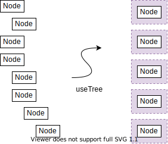

Your Tree can contain business-specific names:
```
{
  myID: 1,
  myKids: [
    {
      myID: 2,
      myKids: [],
    },
    {
      myID: 3,
      myKids: [],
    }
  ]
}
```
 
*useTree* turns your tree into a double-linked list so that its friends can talk about it:
```
const flattened = useTree(myTree, {
  getId: node => node.myId,
  getChildren: node => node.myKids,
  flattenCallback: node => node.myKids.length
});

...

flattened

[
  {
    // Wrapped values:
    id: 1,
    children: [ ... ],
    // Source tree data:
    parent: { id: null, children: ..., parent: ..., node: ... },
    node: {
      myID: 1,
      myKids: []
    }
  },
  {
    id: 2,
    children: [ ... ],
    parent: ...,
    node: ...
  },
  {
    id: 3,
    children: [ ... ],
    parent: ...,
    node: ...
  }
]
```

... Then, more hooks to come will define magical functionality
